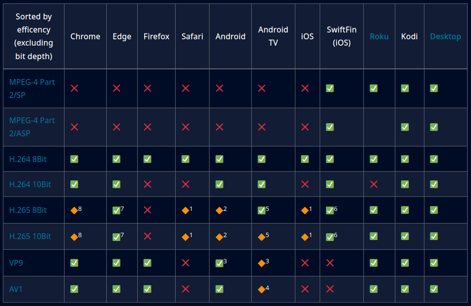
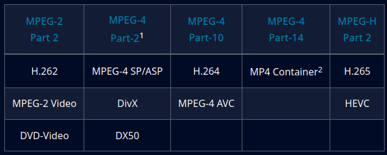
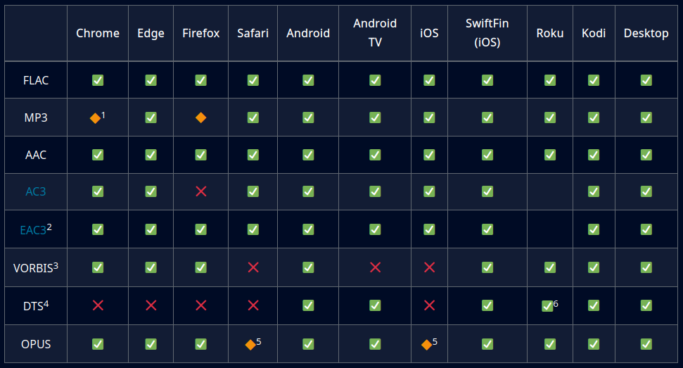
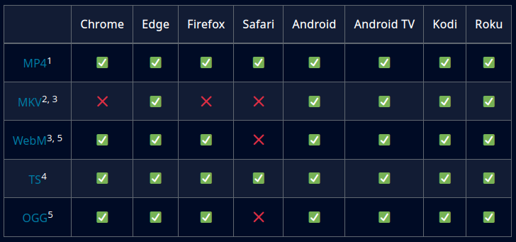
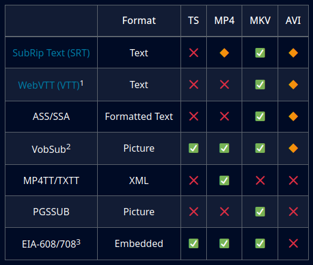

# Codec Compatibility

**Codec Support**

The goal is to `Direct Play` all media. This means the container, video, audio and subtitles are all compatible with the client. If the media is incompatible for any reason, Jellyfin will use FFmpeg to convert the media to a format that the client can process. `Direct Stream` will occur if the audio, container or subtitles happen to not be supported. **If the video codec is unsupported, this will result in video transcoding**.

Subtitles can be tricky because they can cause `Direct Stream` (subtitles are remuxed) or `video transcoding` (burning in subtitles) to occur. This is the most intensive CPU component of transcoding. Decoding is less intensive than encoding.


## Video Compatibility

[Breakdown of video codecs.](https://developer.mozilla.org/en-US/docs/Web/Media/Formats/Video_codecs)

[Test your browser's compatibility for any codec profile](https://cconcolato.github.io/media-mime-support/)



<sup>1</sup>HEVC is only supported in MP4, M4V, and MOV containers.  
<sup>2</sup>Android playback is currently broken. Client reports that HEVC is supported and attempts to Direct Stream.  
<sup>3</sup>May be (partially) dependent on Hardware support (can be compensated with CPU decoding on Android). Most new Android phones in the higher price range and many "4K" Android TV devices have VP9 hardware decoding support. Refer to you manufacturer for supported codecs.  
<sup>4</sup>Needs atleast Android TV 10  
<sup>5</sup>As of [version 0.12](https://github.com/jellyfin/jellyfin-androidtv/pull/671), HEVC is enabled on all devices running Android 5.0+, but early generations of the Amazon Fire may not work yet. 10Bit may be supported depending on your device. Before Client 0.12, HEVC support was enabled on specific devices.  
<sup>6</sup>HEVC decoding is supported on Apple devices with the A8X chip or newer and at least iOS 14  
<sup>7</sup>HEVC decoding is only supported on Windows 10 with the HEVC Video Extension from the [Microsoft store](https://www.microsoft.com/store/productId/9NMZLZ57R3T7).  
<sup>8</sup> Chromium 104 does support HEVC decoding when launched with `--enable-features=PlatformHEVCDecoderSupport` argument. For more informations please look at [enable-chromium-hevc-hardware-decoding](https://github.com/StaZhu/enable-chromium-hevc-hardware-decoding#readme).

?> [Format Cheatsheet](https://en.wikipedia.org/wiki/MPEG-4#MPEG-4_Parts)




## Audio Compatibility

If the audio codec is unsupported or incompatible (such as playing a 5.1 channel stream on a stereo device), the audio codec must be transcoded. This is not nearly as intensive as video transcoding.



<sup>1</sup>MP3 Mono is incorrectly reported as unsupported and will transcode to AAC.  
<sup>2</sup>Only EAC3 2.0 has been tested.  
<sup>3</sup>OGG containers are not supported and will cause VORBIS to convert.  
<sup>4</sup>Only DTS Mono has been tested.  
<sup>5</sup>Safari only supports opus in .caf files  
<sup>6</sup>Supported via passthrough on all devices. Native support for [AC3 & E-AC3](https://www.atsc.org/wp-content/uploads/2015/03/A52-201212-17.pdf) on Roku TVs & Ultra.


## Container Compatibility

If the container is unsupported, this will result in remuxing. The video and audio codec will remain intact but wrapped in a supported container. This is the least intensive process. Most video containers will be remuxed to use the HLS streaming protocol and TS containers. Remuxing shouldn't be a concern even for an RPi3.



<sup>1</sup>MP4 containers are one of the few containers that will not remux.  
<sup>2</sup>MKV containers can hold nearly any codec, but are not compatible with streaming in Firefox and will remux.  
<sup>3</sup>MKV containers are improperly labeled as WebM in Firefox during playback.  
<sup>4</sup>TS is one of the primary containers for streaming for Jellyfin.  
<sup>5</sup>WebM and OGG have limited codec support (by design), refer to this for WebM and this for OGG.

## Subtitle Compatibility

Subtitles can be a subtle issue for transcoding. Containers have a limited number of subtitles that are supported. If subtitles need to be transcoded, it will happen one of two ways: they can be converted into another format that is supported, or burned into the video due to the subtitle transcoding not being supported. Burning in subtitles is the most intensive method of transcoding. This is due to two transcodings happening at once; applying the subtitle layer on top of the video layer.

?> Here is a [breakdown](https://www.afterdawn.com/guides/archive/subtitle_formats_explained.cfm) of common subtitle formats.



<sup>1</sup>VTT are supported in an [HLS Stream](https://helpx.adobe.com/adobe-media-server/dev/webvtt-subtitles-captions.html).  
<sup>2</sup>DVB-SUB ([SUB + IDX](https://forum.videohelp.com/threads/261451-Difference-between-SUB-and-IDX-file)) is another name for VobSub files.  
<sup>3</sup>EIA-608/708 subtitles are embedded in private channels (channel 21) in a MPEG video codec. EIA-608 are standard CC subtitles with the black bar background, while EIA-708 are typically SDH.

## Types of Subtitles

There are NOT many variations of subtitles. The two basic types of subtitles are plain-text based such as **SubRIP** also called **SRT** and **ASS** (file extensions), and image based subtitles which are mostly used on DVD medias called **VobSUB**.

Furthermore, these subtitles have whats called a disposition inside the media container and can only be in one of three states:

1. **0** for Off
2. **Default**
3. **Forced**

### Soft Subs

This is the generic name for subtitles that can be turned on or off. This type of subtitle uses one or more designated subtitle streams within the media container and can only be in one of the three states described above.  
This category includes picture-based subtitles (**VobSUB**) as well as text-based like **SRT** and **ASS**.

!> These subtitles are usually normal subtitles or **SDH** (**S**ubtitles for **D**eaf and **H**ard of hearing). There is not a big difference between them other than including extra content such as background noises.

### Burned-in (Hard Subs)

Burned-in subtitles are subtitles that have been permanently placed in the video and cannot be turned off. At this point I wouldn't even call them subtitles since they are in the video stream and cannot be removed.

### CC (Closed Captioning)

CC subtitles also known as EIA-608/708 subtitles are embedded in private channels (channel 21) in a MPEG video codec, however they can be turned on or off at will. EIA-608 are standard CC subtitles with the black bar background, while EIA-708 are typically SDH

This format is falling out of favor for using the designated subtitle stream with the various media containers as it provides increased configuration flexibility.

?> If you wanted to remove CC subs, the following [ffmpeg parameters](https://trac.ffmpeg.org/wiki/HowToExtractAndRemoveClosedCaptions) can be used during remuxing or transcoding:


```
-bsf:v "filter_units=remove_types=6"
```

The full command would look like this:
```
# mkv remux example:
ffmpeg -y -i input.mkv -map 0 -c copy -bsf:v "filter_units=remove_types=6" output.mkv

# mp4 remux example:
ffmpeg -y -i input.mp4 -map 0 -movflags faststart -c copy -bsf:v "filter_units=remove_types=6" output.mp4

# real world example:
for f in *.mkv; do ffmpeg -y -i "$f" -f srt -i "${f/mkv/srt}" -map 0:v:0 -map 0:a:0 -map 1:0 -default_mode infer_no_subs -dn -map_chapters -1 -metadata:s:v:0 title= -metadata:s:a:0 title= -metadata:s:s:0 title= -metadata:s:a:0 language=eng -metadata:s:s:0 language=eng -metadata creation_time="$(date -Iseconds)" -metadata:s:v creation_time="$(date -Iseconds)" -metadata:s:a creation_time="$(date -Iseconds)" -bsf:v "filter_units=remove_types=6" -disposition:s 0 -disposition:a:0 default -disposition:v:0 default -channel_layout "5.1" -c:v copy -c:a aac -c:s srt .working/"${f/DDP/AAC}"; done
```

