<!-- docs/faq.md -->
## Having trouble logging in?

:far fa-frown: Usually the cause of this is an issue with the cookies in your local browser cache. To test, bypass the browser cache by opening a new incognito window :fas fa-user-secret: or whatever the equivilent is called with the browser you're using and try to login there. If that works but the normal way did not, then [clear your browser cache/cookies](https://support.google.com/accounts/answer/32050?co=GENIE.Platform%3DDesktop&hl=en) :fas fa-cookie-bite:.

> Make sure that you checkmark cookies from the advanced section. Be aware that **this action will delete cookies for all sites instead of only travisflix.com**.

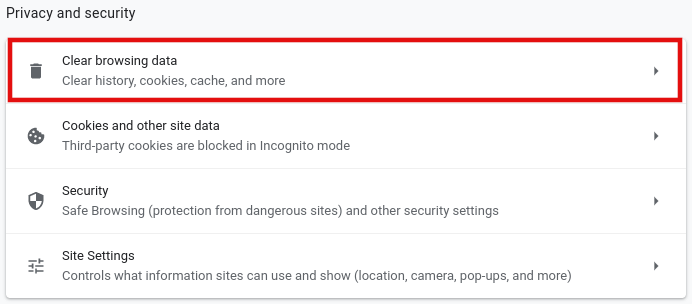
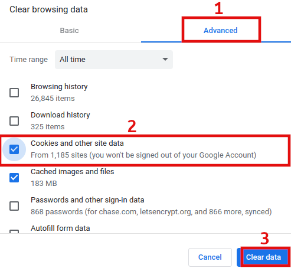

> If you feel the issue resides on the server-side, [check the status page](#where-is-the-status-page) and/or the [real-time server statistics](#do-you-have-server-statistics).


## Media stream buffering/glitching?

###  Wireless Users

:performing_arts: I wanted to include the following tip at the very top of this section because I had this exact problem. If you're a WiFi user, the first troubleshooting step you can perform on your own is to get off the wireless and hardwire yourself in with a standard CAT 5E/6 :fas fa-ethernet: ethernet cable. If you only have CAT 5, throw that shit away.

If you insist on using WiFi, then you're going to need to ensure that you're connected to a SSID that uses **802.11ac** and is using a **wide band such as 80 or 160**.

> The **802.11n wireless standard can utilize both 2.4 and 5 Ghz frequencies**. Just because you assume you're on 5 Ghz (*by connecting to a SSID with "-5G" appended*), that doesn't technically indicate you're on 802.11ac.


###  Hardwire Users

1) During video playback---In your browser click the settings/cog (:fa fa-cog:) button underneith the progress bar to the right of the video controls
2) Ensure **QUALITY** is set to **AUTO**
3) Click `PLAYBACK DATA`
4) Under Playback Info--Determine the play type displayed next to **Play method:**
5) If it's **"DirectPlay"**, this means the server is streaming the direct media file to your computer without a problem, however the cause of intermittent buffering/glitching could be due to you not having enough bandwidth to support the playback of the media file. This doesn't necessarily mean your ISP connection doesn't have enough bandwidth, but could mean:
    * Your connection to your home router or switch has an issue
    * The available bandwidth is being consumed by another user (ie. Bittorrent without speed limits defined)
    * Your internet traffic is being shaped by your ISP with observable negative impact on its customers
    * There's probably many more, I just can't think of any right now
    * See [Video not streaming?](#video-not-streaming) below for help running a bandwidth test


You can also get a sense for how much bandwidth is required by looking at the video's bitrate info which is available by clicking on the ellipsis of the media's image poster, then clicking Media Info.

 ... 


## Video not streaming?

> The streaming software (Jellyfin) does have logic which determines that your networks ingress (download) bandwidth is insufficient to stream the video playback and will automatically start attempting to [transcode](https://en.wikipedia.org/wiki/Transcoding) the media from its original format into a format that is more compatible with your device. When this happens you will have a delay of at least a few seconds before playback (usually between 5-15 seconds). Additional reasons for transcoding can be found under **"Play method:"** discussed further above. If it's transcoding, the play method will state **HLS** and not **DirectPlay**.

:game_die: First, try to eliminate the more obvious culprits such as using an old device, system, operating system, or browser.
1. [Check if multiple versions are available](#how-to-stream-multiple-versions-of-a-film) of the stream you are having trouble with.
    * If multiple versions exist then try selecting the version in the drop-down menu which was not selected by default, then hit Play.
    * Versions with **RARBG** in the suffix is recommended if the other is not working for you.<br>
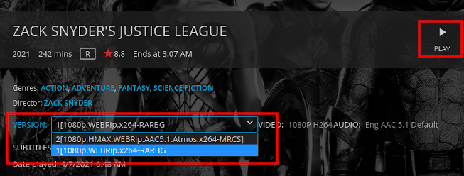<br>
2. Make sure that your network connection is idle (at the router WAN port, not only your PC if you have multiple devices), otherwise results will be inaccurate.
3. Open [speed.travisflix.com](http://speed.travisflix.com/) (tests speed directly from streaming server), or [fast.com](https://fast.com/) and run a few tests.
4. Note how much bandwidth you have at your disposal dedicated to downloading (The **Download** bandwidth is the only important factor).
5. As a general guideline, you should have a minimum of 20 Mbps of banwdidth available at your disposal for the download stream (called ingress), however there are some large media files including 4K content which requires a faster download speed of 50+ Mbps.
    * Testing has showed that the average bandwidth required for playback of a 100MB sample video is 11.74 Mbps
    ```shell-session
    vnstat -i enp4s0 -tr 30
44816 packets sampled in 30 seconds
Traffic average for enp4s0

      rx        11.74 Mbit/s           993 packets/s
      tx       337.67 kbit/s           499 packets/s
      ```
    * Further testing has showed that during the loading of a video stream, your device tries to download almost as much as possible probably to buffer the video more than normal, and under the remainder of the stream you really only use an average of 4-7 Mbps<br>
    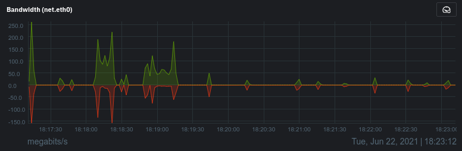
    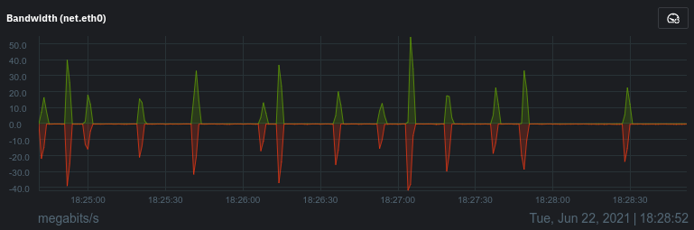
6. General rule of thumb--if the content's bitrate > 10,000 Kbps it is going to require a faster connection. Maybe this is the time to upgrade to Frontier/Fios? 
7. I have been a long-term Fios user, couldn't be happier with the service but I could be happier with the large bills past the first year "discounted rate" bullshit. If you might host stuff on your connection, look for their  symmetrical residential internet service such as 100 Mbps UP & DOWN.

```shell-session
$ speedtest-cli
Retrieving speedtest.net configuration...
Testing from Frontier Communications.
Retrieving speedtest.net server list...
Selecting best server based on ping...
Hosted by Whitesky Communications LLC (Los Angeles, CA) [29.64 km]: 16.822 ms
Testing download speed ......................................................................................
Download: 79.41 Mbit/s
Testing upload speed ........................................................................................
Upload: 122.33 Mbit/s
```


## Subtitles not loading?

:far fa-closed-captioning: This problem mostly occurs with TV show episodes, but could occur with some movies as well. After you have selected the subtitle and it fails, wait about 60 seconds and re-select the same subtitle again.
The root cause results from the server needing to retrieve the entire media file from the data-source before the subtitle stream can be extracted and pushed out to the client. Most TV episodes are large media files and so it will take roughly 30-60 seconds to download the entire episode. In rare cases it may take even longer than 60 seconds, especially if the server is heavily loaded.


## Supported devices or platforms?

* :fas fa-desktop: PC/Mac/Linux with modern browser such as Chrome/Firefox/Edge/Safari
  * :fab fa-windows: Windows 7-10, :fab fa-linux: Linux kernel 2.4+, :fab fa-apple: MacOS (no legacy versions)
* :fas fa-mobile-alt: Smartphones (:fab fa-android:/:fab fa-apple:/:fab fa-windows:) and tablets with HTML5 supported browsers
* :fab fa-amazon: Amazon Fire TV Stick ([native Jellyfin app](https://www.amazon.com/Jellyfin/dp/B081RFTTQ9/))
* :fas fa-tablet-alt: Roku ([native Jellyfin app](https://channelstore.roku.com/details/cc5e559d08d9ec87c5f30dcebdeebc12/jellyfin))
* :fas fa-tablet: Kodi 19+ ([native Jellyfin plugin](https://jellyfin.org/posts/kodi-0-5-0/))

> Official Jellyfin documentation: [jellyfin.org/docs/general/clients/index.html](https://jellyfin.org/docs/general/clients/index.html).


## Can I Upload files?

:fas fa-cloud-upload-alt: Yes, indeed young gwasshoppa.

1. Go to [upload.travisflix.com](https://upload.travisflix.com)
2. Either click where it says to, or use file explorer and drag-and-drop
    * You can select multiple files per upload session
    * The **maximum file size upload limit is 5GB** (*combined¿?*)
    * All uploaded files are automatically deleted after 24 hours<br>
    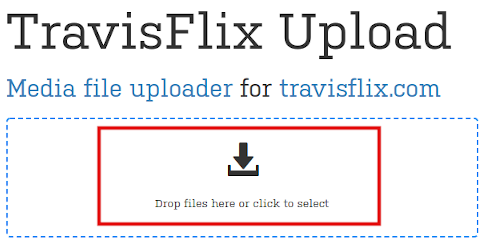
3. Sit back and wait ¯\_(ツ)_/¯
4. When the upload is complete, use the handy-dandy email form presented to you
    * In the image below, my email address (travisrunyard@gmail.com) should be entered under *"Your friend's email"*
    * In the event you have a catastrophic case of trigger-finger and have skipped the step above, email <travisrunyard@gmail.com> to let me know what you have uploaded so I can add it to the library (*date/time of upload would be helpful if you feel like the Earth won't be a big smoking ball of shit in the near future*)<br>
    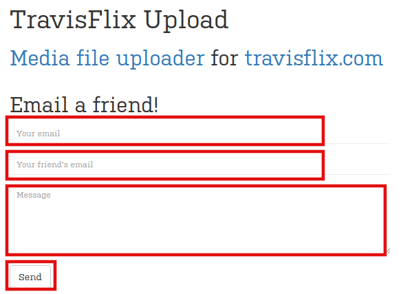


## VPN Remote Users: Allowed Countries?

:triangular_flag_on_post: The following list of countries are allowed access to the site.
> :fas fa-globe-americas: VPN Users make sure that you are VPN'ing to one of these countries or you will be blocked.

  1. United States :toilet: :fas fa-beer: :fas fa-cannabis: :fas fa-flag-usa:
  2. Canada :fas fa-cannabis: :mute:
  3. Switzerland :children_crossing:
  4. Sweeden :no_smoking:
  5. Netherlands :fas fa-cannabis: :syringe:
  6. Singapore :fas fa-transgender-alt:
  7. Mexico :fas fa-pepper-hot:
  8. Finland
  9. Ireland


You will see Cloudflare error 1020 if you do not connect from these countries.

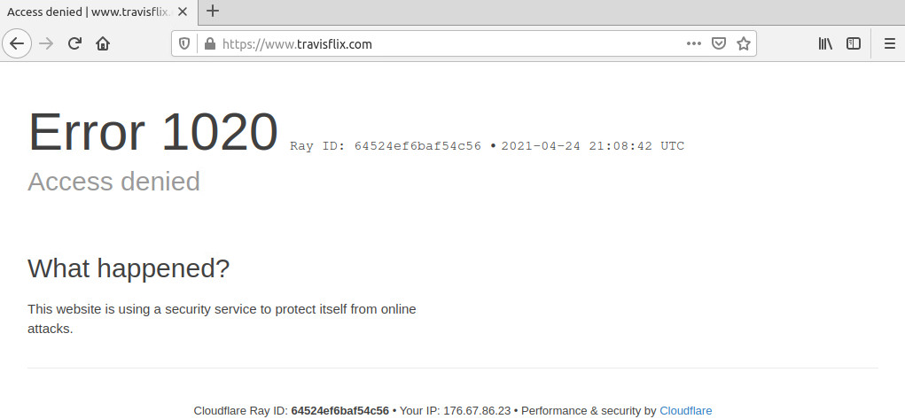

If you would like to request another country be allowed, contact me at <travisrunyard@gmail.com> or join the Telegram room at [t.me/travisflix](https://t.me/travisflix).


## Video not filling the screen?

* :movie_camera: Movies are composed in a variety of shapes, called aspect ratios. Most of these aspect ratios do not match the exact aspect ratio of your widescreen TV or computer monitor. Most older movies were made primarily in the 1.37:1 aspect ratio. This means that the image is 1.37 times as wide as it is high.
* A typical widescreen HDTV set has an aspect ratio of 1.78:1. This means that it is 1.78 times as wide as it is high. This ratio was determined several years ago by looking at all the aspect ratios in use and 1.78:1 fit every aspect ratio within its borders in some way. Very few movies were ever produced in 1.78:1 (the most notable being Toy Story), so you are going to see black bars on many movies that are shown in their original aspect ratio.
* Films with an **aspect ratio of less than 1.78:1 will have black bars displayed on the sides of a widescreen HDTV. A movie with an aspect ratio greater than 1.78:1 will have black bars at the top and bottom.** :left_right_arrow:


## How to stream multiple versions of a film?

:fas fa-signal: Some movies/shows have multiple versions available to stream. These versions will either state different qualities (1080p vs 720), or there can be special edititions such as: remastered editions, alternate endings, directors cuts, theatrical editions etc.

:fas fa-info-circle: *Notice for the movie "Avatar" there are four different versions available as indicated by the yellow circle with number 4 in the top left corner.*

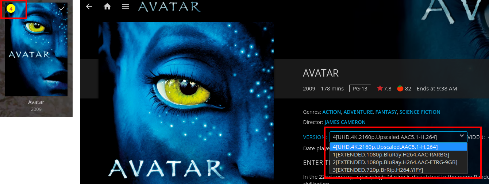

Apocolypse Now has 3 distinct editions available:

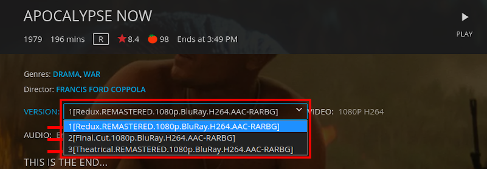


## Plain-text media list/index

These plain-text files contain an index of all media for which it corresponds. The files are regenerated every hour 24/7/365 for the most up-to-date media info.

:fas fa-list: [/movies.txt](https://travisflix.com/movies.txt)<br>
:fas fa-list: [/shows.txt](https://travisflix.com/shows.txt)<br>
:fas fa-list: [/standup.txt](https://travisflix.com/standup.txt)<br>
:fas fa-list: [/motogp.txt](https://travisflix.com/motogp.txt)<br>
:fas fa-list: [/tech.txt](https://travisflix.com/tech.txt)<br>
:fas fa-list: [/tennis.txt](https://travisflix.com/tennis.txt)<br>
:fas fa-list: [/podcasts.txt](https://travisflix.com/podcasts.txt)<br>
:fas fa-list: [/starcraft.txt](https://travisflix.com/starcraft.txt)

This is the bash script on the cron schedule that generates the above text files:

```bash
#!/usr/bin/env bash

nginx_www='/usr/local/linuxserver-nginx/config/www'

if [[ -d /usr/local/jellyfin/media && -f /usr/local/jellyfin/media/scriptcheck ]]; then
    # rclone mount exists, no need to remount

    # exit script if variable is empty
    [ -z "$nginx_www" ] && { echo "Error: variable nginx_www is not set or empty"; exit 1; }

    # refresh public text files with media index
    cd /usr/local/jellyfin/media
    find /usr/local/jellyfin/media/video-movies -mindepth 1 -maxdepth 1 -type d -printf '%f\n' | sort > $nginx_www/movies.txt
    find /usr/local/jellyfin/media/video-shows -mindepth 1 -maxdepth 1 -type d -printf '%f\n' | sort > $nginx_www/shows.txt
    tree --noreport -d --charset=en_US.utf8 video-shows >> $nginx_www/shows.txt
    find /usr/local/jellyfin/media/video-standup -mindepth 1 -maxdepth 1 -type d -printf '%f\n' | sort > $nginx_www/standup.txt
    find /usr/local/jellyfin/media/video-tennis -mindepth 1 -maxdepth 1 -type d -printf '%f\n' | sort > $nginx_www/tennis.txt
    find /usr/local/jellyfin/media/video-starcraft -mindepth 1 -maxdepth 1 -type f -printf '%f\n' | sort > $nginx_www/starcraft.txt
    find /usr/local/jellyfin/media/video-tech -mindepth 1 -maxdepth 1 -type d -printf '%f\n' | sort > $nginx_www/tech.txt
    find /usr/local/jellyfin/media/podcasts -mindepth 1 -maxdepth 2 -type d -printf '%f\n' | sort > $nginx_www/podcasts.txt
    tree --noreport --charset=en_US.utf8 podcasts >> $nginx_www/podcasts.txt
    # following two sort reversed
    find /usr/local/jellyfin/media/video-uncategorized -mindepth 1 -maxdepth 2 -type d -printf '%f\n' | sort --reverse > $nginx_www/motogp.txt
    tree --noreport --charset=en_US.utf8 -r video-uncategorized >> $nginx_www/motogp.txt
else
    exit 1

fi
```


## Media storage info?

:fab fa-google-drive: **19.32 TB** as of 06-04-2021<br>

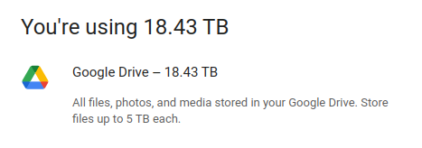

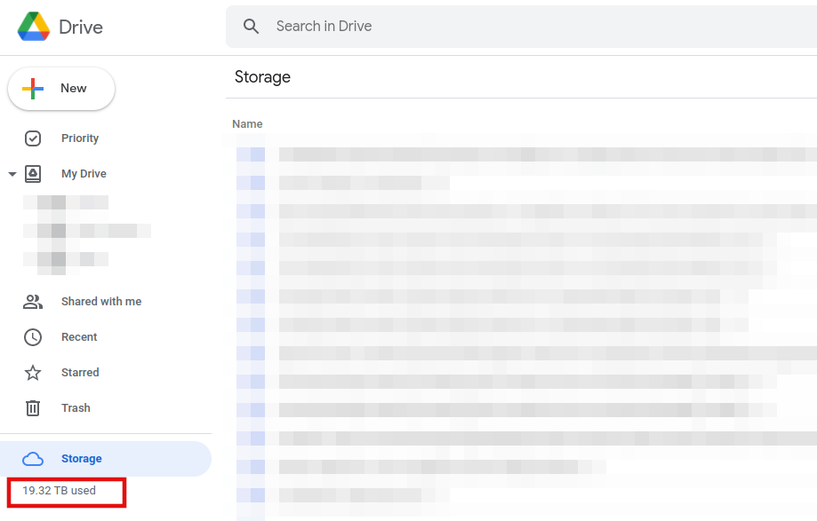

Google Cloud Console API Metrics for Google Drive


## Where is the status page?

:fas fa-server: [status.travisflix.com](https://status.travisflix.com/)

The 30 day cumulative HTTP uptime for travisflix.com has on average been between **99.90%** - **99.96%**

>  This percentage is referred to as "SLA" (service level agreement). For instance, the [Google Workspace SLA](https://workspace.google.com/intl/en/terms/sla.html) is 99.9% for Search, Gmail, Docs, Drive, Chat, Voice, etc.
> You can view the status for Google here [google.com/appstatus](https://www.google.com/appsstatus).

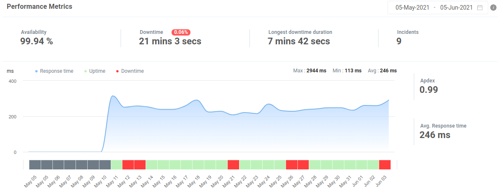

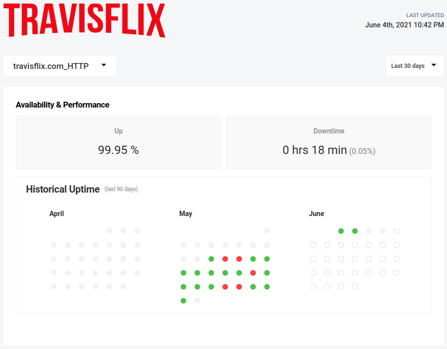

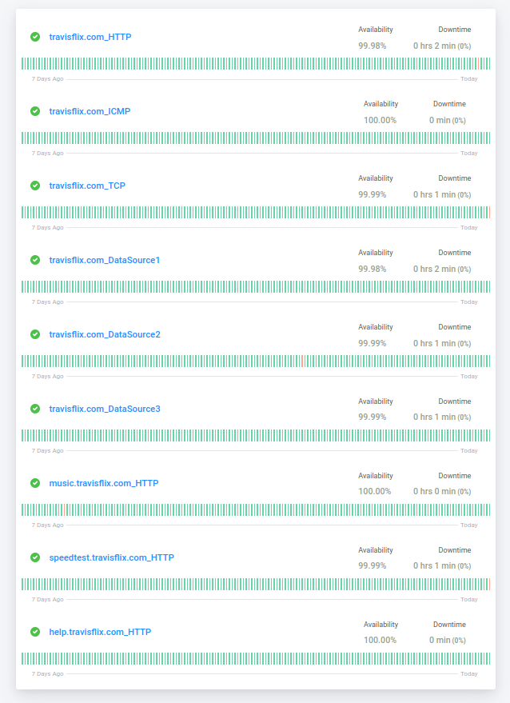


## Do you have server statistics?

:fas fa-server: [statistics.travisflix.com](https://statistics.travisflix.com/)

**Click any white-space** within the iframe below in order for the Netdata Dashboard to activate:

<iframe src="//statistics.travisflix.com/netdata.html" width="100%" height="870px" style="border:0px;overflow-y:visible;" scrolling="yes"></iframe>


## Status of the media sync processes?

:black_joker: The badges below show a real-time representation of the media encryption and syncing processes between the origin and destination Google Drive accounts. These GDrive accounts are what feed the video files to the server which then streams to your eyeballs.

  1) OVERALL STATUS
  2) `rclone-sync-video`: Rclone media sync operation which encrypts media and pushes to Google Drive aka--"GCrypt"
  3) `rclone-sync-p0ds0smb`: Rclone data sync operation to push/pull encrypted **NON**-media data to GCrypt (FreeNAS pools > Encrypt > Google Drive)
  4) `rclone-servercopy`: Rclone server-side sync job from gdrive-usmba:gcrypt to gdrive-gdrive01dvecs:gcrypt and gdrive-gdrive02dvecs:gcrypt
  5) `rclone-servercopy-media`: Server-side media-only rclone sync operation which pushes changes to multiple GDrive accounts for redundancy

      | Type    | Up, late, or down | Up, down |
      |------------------------|------------------------|------------------------|
      | 1. Overall status |  |  | 
      | 2. rclone-sync-video |  |  |
      | 3. rclone-sync-p0ds0smb |  |  |
      4. rclone-servercopy |  |  |
      5. rclone-servercopy-media |  |  |

      ~~~ json
      Overall status:
      https://healthchecks.io/badge/bd39864f-49a7-4916-b223-8e2ac5/dc1ecPD8.json
      rclone-video-sync:
      https://healthchecks.io/badge/bd39864f-49a7-4916-b223-8e2ac5/gp7x30yH/rclone-sync-video.json
      rclone-sync-p0ds0smb:
      https://healthchecks.io/badge/bd39864f-49a7-4916-b223-8e2ac5/F-VXXpPQ/rclone%252Ffreenas.json
      ~~~


## How to Support/Donate?

 Bitcoin (₿) is my preferred unit and medium of currency transfer. However if you do not have or know how to use Bitcoin, I'll provide a couple alternative methods below.

###### REALTIME BITCOIN PRICE: **<iframe src="//btc.travisflix.com" width="100%" height="35px" style="border:0px;overflow-y:hidden;" scrolling="no"></iframe>**

* :fa fa-linode: Linode Platform-as-a-Service (PaaS) operating cost is $10/mo
  * :heavy_dollar_sign: However I don't pay myself
  * :heavy_dollar_sign: The cost to run cloud data storage legitimately would range from $150-200/mo or $1800-2400/yr

> **Option #1**
> [](https://greenaddress.it/pay/GA2GtnSV73LMTzpauEKZsJnRD1yxWf/)<br>
> [32Z8bRQPcip4avcGWujSqLGAmDt52m1Wy4](bitcoin:32Z8bRQPcip4avcGWujSqLGAmDt52m1Wy4)
>
> Here is the related QR code associated with my BTC address beginning with "32Z8bRQ":<br>
> 
---
> **Option #2**
> [bc1q690p3utevcus3mscnq5anegz7a3m7cjv4vvd6g](bitcoin:bc1q690p3utevcus3mscnq5anegz7a3m7cjv4vvd6g)
> 
> Here is the related QR code associated with my BTC address beginning with "bc1q690":<br>
> 


## Still have questions?

:incoming_envelope: Send me an email at <travisrunyard@gmail.com> or join the Telegram room at [t.me/travisflix](https://t.me/travisflix). My contact information is also available online at [travisyard.run](https://travisyard.run/).

---
