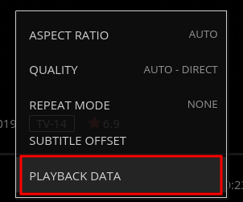

<!-- docs/faq.md -->
## Having trouble logging in?

:no_entry_sign: :shit: Almost 100% of the time, the root cause of this is something not right in your local browser cache. To bypass your browser cache, simply open a new Chrome incognito window or whatever the equivilent is called with the browser you're using and try logging in there. If that does work, but the normal way didn't, then learn how to clear your cache you retard.

## Media stream buffering/glitching?

###  Wireless Users

I wanted to include the following tip at the very top of this section because I had this exact problem. If you're a WiFi user, the first troubleshooting step you can perform on your own is to get off the wireless and hardwire in with the standard `Cat5e/6` ethernet cable. If you only have `Cat5` throw that shit away. If you insist on using WiFi, then you're going to need to ensure that you're connected to a SSID that uses **802.11AC** (5 Ghz freq.) and is using a wide band such as 80 or 160.
> The **802.11n wireless standard can utilize both 2.4 and 5 Ghz frequencies**...So just because you assume you're on 5 Ghz (*by connecting to a SSID with "-5G" appended*), that doesn't technically indicate you're on 802.11AC. 

###  Hardwire Users

1) While playing a video--in your browser click the Settings/Gear button underneith the progress bar to the right of the video controls
2) Ensure **QUALITY** is set to **AUTO**
3) Click `PLAYBACK DATA`
4) Under Playback Info--Determine the play type displayed next to **Play method:**
5) If it's **"DirectPlay"**, this means the server is streaming the direct media file to your computer without a problem, however the cause of intermittent buffering/glitching could be due to you not having enough bandwidth to support the playback of the media file. This doesn't necessarily mean your ISP connection doesn't have enough bandwidth, but could mean:
    * Your connection to your home router or switch has an issue
    * The available bandwidth is being consumed by another user (ie. Bittorrent without speed limits defined)
    * Your internet traffic is being shaped by your ISP with observable negative impact on its customers
    * There's probably many more, I just can't think of any right now
    * See [Media won't play?](https://help.travisflix.com/#/faq?id=media-won39t-play) below for help running a bandwidth test

 ... 

You can also get a sense for how much bandwidth is required by looking at the video's bitrate info which is available by clicking on the ellipsis of the media's image poster, then clicking `Media Info`.

 ... 

:signal_strength: The server actually does have logic which determines that your network's ingress bandwidth is insufficient to play the video and will automatically start trying to transcode the file from it's original form into a format which is more compatible with your device. When this does happen, video's will have a delay of a second or two before playing normally. Often more reasons for the server deciding to transcode the media is found under **"Play method:"** discussed fruther above. If it's actively transcoding, the Play method will state **HLS** and not **DirectPlay**.

## Media won't play?

First, try to eliminate the obvious reasons such as using a device so old that it really should be thrown away. If you're using old shit, I can't help.
1. Make sure that your network connection is idle (at the router WAN port, not only your PC if you have multiple devices), otherwise results will be inaccurate
2. Go to [librespeed.org](https://librespeed.org/) or [fast.com](https://fast.com/) and run a couple of tests
3. Note how much bandwidth you have at your disposal dedicated to downloading (The **Download** bandwidth is the only important factor)
4. As a generic guideline you should have at least 25 Mbps download banwdidth available at your disposal, however there are some large media files including 4K content which requires a faster download speed of 50+ Mbps
5. General rule of thumb--if the content's bitrate > 10,000 Kbps it is going to require a faster connection. Maybe this is the time to upgrade to Frontier/Fios? 
6. I have been a long-term Fios user, couldn't be happier with the service but I could be happier with the large bills past the first year "discounted rate" bullshit. If you might host stuff on your connection, look for their  symmetrical residential internet service such as 100 Mbps UP & DOWN.
    ~~~bash
    visualblind$ speedtest
    Retrieving speedtest.net configuration...
    Testing from Frontier Communications (!!REDACTED!!)...
    Retrieving speedtest.net server list...
    Selecting best server based on ping...
    Hosted by Whitesky Communications LLC (Los Angeles, CA) [29.64 km]: 16.822 ms
    Testing download speed ......................................................................................
    Download: 79.41 Mbit/s
    Testing upload speed ........................................................................................
    Upload: 122.33 Mbit/s
    ~~~

:signal_strength: The server actually does have logic which determines that your network's ingress bandwidth is insufficient to play the video and will automatically start trying to transcode the file from it's original form into a format which is more compatible with your device. When this does happen, video's will have a delay of a second or two before playing normally. Often more reasons for the server deciding to transcode the media is found under **"Play method:"** discussed fruther above. If it's actively transcoding, the Play method will state **HLS** and not **DirectPlay**.

## Subtitles not loading?

🎬 This problem mostly occurs with episodes of TV shows/series, but could happen to some movies as well. After you have selected the subtitle and it fails, ***wait about 30-45 seconds and try selecting the same subtitle again.***
The root issue results from the server having to retrieve the entire media file from the data source before the subtitle stream can be extracted and pushed out to the client. Most of the TV episodes are large files so it takes about 30 seconds to pull it down at between 250-1000 Mbps.

## Supported devices or platforms?

* PC/Mac/Linux with modern browser such as Chrome/Firefox/Edge/Safari
  * Windows 7-10, Linux kernel 2.4+, MacOS (not recommended to use Apple devices with TravisFlix)
* All modern smartphones/tablets with HTML5 supported browsers listed above
* Amazon Fire TV Stick ([native Jellyfin app](https://www.amazon.com/Jellyfin/dp/B081RFTTQ9/))
* Roku ([native Jellyfin app](https://channelstore.roku.com/details/cc5e559d08d9ec87c5f30dcebdeebc12/jellyfin))
* Kodi 19+ ([native Jellyfin plugin](https://jellyfin.org/posts/kodi-0-5-0/))

## Video not filling the screen?

> :movie_camera: Movies are composed in a variety of shapes, called aspect ratios. Most of these aspect ratios do not match the exact aspect ratio of your widescreen TV or computer monitor. Most older movies were made primarily in the 1.37:1 aspect ratio. This means that the image is 1.37 times as wide as it is high.
A typical widescreen HDTV set has an aspect ratio of 1.78:1. This means that it is 1.78 times as wide as it is high. This ratio was determined several years ago by looking at all the aspect ratios in use and 1.78:1 fit every aspect ratio within its borders in some way. Very few movies were ever produced in 1.78:1 (the most notable being Toy Story), so you are going to see black bars on many movies that are shown in their original aspect ratio.
Films with an **aspect ratio of less than 1.78:1 will have black bars displayed on the sides of a widescreen HDTV. A movie with an aspect ratio greater than 1.78:1 will have black bars at the top and bottom.** :+1: 

## How to stream multiple versions of a film?

:x: For some movies and tv shows there are multiple versions of the same film available to stream. Additionally for other films, there are multiple versions of the same film but with a distinctive difference, such as REMASTERED EDITION, Alternate Ending, Director's Cut, Theatrical Edition etc..There are also multiple versions of films in which the only difference is movie quality/aspect size like 720p vs 1080p vs 2160p (4K).

You'll notice for the movie *Avatar (2009)* there are 4 different versions available, as can be noted from the yellow number 4 in the **top left corner of the movie poster**.

 

Another example is *I Am Legend* with an **ALTERNATE ENDING**:

## Media storage info?

:hammer: Over 16 terabytes as of 01/28/2021. Three words--Google Drive and eBay. Total cost: $4*3=$12.

> Google Cloud Console API Metrics for Google Drive

## Where is the status page?

:link: [status.travisflix.com](https://status.travisflix.com/)

Uptime over the standard 30 day time period is currently: **99.954%**

>  This percentage figure is often referred to within SLA (service level agreements). For instance, the SLA for the "Google Workspace Service Level Agreement" which includes service like Gmail, Docs, Drive, Chat, Voice etc is 99.9% however being a corporate cocksuck, they include needless jargon words to make it so convoluted you just want to close the page and stay in the fetus posistion for the next 4 days.

## Status of the media sync processes?

:bar_chart: The badges below show a real-time representation of the media encryption and syncing processes between the origin and destination Google Drive accounts. These GDrive accounts are what feed the video files to the server which then streams to your eyeballs.

  1) OVERALL STATUS
  2) `rclone-sync-video`: Rclone media sync operation which encrypts media and pushes to Google Drive aka--"GCrypt"
  3) `rclone-sync-p0ds0smb`: Rclone data sync operation to push/pull encrypted **NON**-media data to GCrypt (FreeNAS pools > Encrypt > Google Drive)
  4) `rclone-servercopy`: Rclone server-side sync job from gdrive-usmba:gcrypt to gdrive-gdrive01dvecs:gcrypt and gdrive-gdrive02dvecs:gcrypt
  5) `rclone-servercopy-media`: Server-side media-only rclone sync operation which pushes changes to multiple GDrive accounts for redundancy

      | Type    | Up, late, or down | Up, down |
      |------------------------|------------------------|------------------------|
      | 1. Overall status |  |  | 
      | 2. rclone-sync-video |  |  |
      | 3. rclone-sync-p0ds0smb |  |  |
      4. rclone-servercopy |  |  |
      5. rclone-servercopy-media |  |  |

      ~~~ json
      Overall status:
      https://healthchecks.io/badge/bd39864f-49a7-4916-b223-8e2ac5/dc1ecPD8.json
      rclone-video-sync:
      https://healthchecks.io/badge/bd39864f-49a7-4916-b223-8e2ac5/gp7x30yH/rclone-sync-video.json
      rclone-sync-p0ds0smb:
      https://healthchecks.io/badge/bd39864f-49a7-4916-b223-8e2ac5/F-VXXpPQ/rclone%252Ffreenas.json
      ~~~

## How to Support/Donate?

 Bitcoin (₿) is my preferred unit and medium of currency transfer. However if you do not have or know how to use Bitcoin, I'll provide a couple alternative methods below.

###### REALTIME BITCOIN PRICE: **<iframe src="//btc.travisflix.com" width="100%" height="35px" style="border:0px;overflow-y:hidden;" scrolling="no"></iframe>**

* Operating expense to run travisflix.com on Linode PaaS = $10 per month
  * however, I don't pay myself...
  * if I were to pay for cloud storage legitimately, that cost would easily hit $200/month---$2400/year

> **Option #1**
>  
> [32Z8bRQPcip4avcGWujSqLGAmDt52m1Wy4](bitcoin:32Z8bRQPcip4avcGWujSqLGAmDt52m1Wy4)
>
> Here is the related QR code associated with my BTC address beginning with "32Z8bRQ": 
> 
---
> **Option #2**
> [bc1q690p3utevcus3mscnq5anegz7a3m7cjv4vvd6g](bitcoin:bc1q690p3utevcus3mscnq5anegz7a3m7cjv4vvd6g)
> 
> Here is the related QR code associated with my BTC address beginning with "bc1q690": 
> 

## Still have questions?

:question: Send me an email at <travisrunyard@gmail.com> or join the Telegram room at [t.me/travisflix](https://t.me/travisflix). My contact information is also available online at [travisyard.run](https://travisyard.run/).

---
