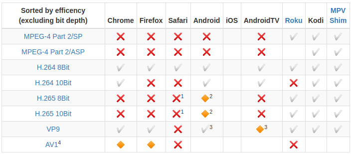
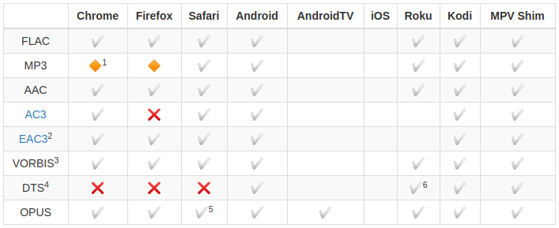
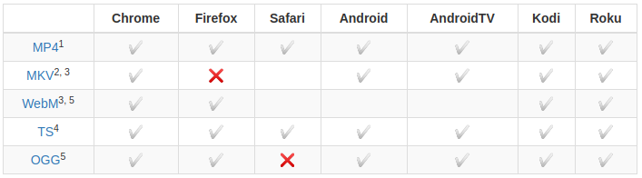

<!-- docs/guide.md -->
## The Gist
The goal is to allow user devices to stream/playback all media as if you accessed the actual video file directly in the browser and began playing it back with the native HTML5 media player (html5 video)[https://www.w3schools.com/html/html5_video.asp]. This means the container, video, audio and subtitles are all compatible with the client. If the media is incompatible for any reason, Jellyfin will use FFmpeg to convert the media to a format that the client can process. Direct Stream will occur if the audio, container or subtitles happen to not be supported. If the video codec is unsupported, this will result in video transcoding. Subtitles can be tricky because they can cause Direct Stream (subtitles are remuxed) or video transcoding (burning in subtitles) to occur. This is the most intensive CPU component of transcoding. Decoding is less intensive than encoding.

## Video Compatibility

- HEVC support is potentially available by offloading to the operating system, but this has not been tested.
- Android playback is currently broken. Client reports that HEVC is supported and attempts to Direct Stream.
- May be (partially) dependent on Hardware support (can be compensated with CPU decoding on Android). Most new Android phones in the higher price range and many "4K" AndroidTV devices have VP9 hardware decoding support. Refer to you manufacturer for supported codecs.
- AV1 support is experimental and often too slow for CPU decoding. As of writing this (05.2020) there is no hardware support on most devices yet.

## Audio Compatibility
If the audio codec is unsupported or incompatible (such as playing a 5.1 channel stream on a stereo device), the audio codec must be transcoded. This is not nearly as intensive as video transcoding.

## Container Compatibility
If the container is unsupported, this will result in remuxing. The video and audio codec will remain intact, but wrapped in a supported container. This is the least intensive process. Most video containers will be remuxed to use the HLS streaming protocol and TS containers. Remuxing shouldn't be a concern even for an RPi3.

- MP4 containers are one of the few containers that will not remux.
- MKV containers can hold nearly any codec, but are not compatible with streaming in Firefox and will remux.
- MKV containers are improperly labeled as WebM in Firefox during playback.
- TS is one of the primary containers for streaming for Jellyfin.
- WebM and OGG have limited codec support (by design).