# Support FAQ

## Having Trouble Logging In

### SELECT SERVER Error Message:

The root cause of this problem is due to the `jellyfin_credentials` key value differing from the current server identification number in your web browsers Local Storage. You will experience this problem whenever the server software has updated or changed, and thereby changing the ID number. When your browser looks for the old number, it will not be able to locate it and then display the `Select Server` interface in the browser.

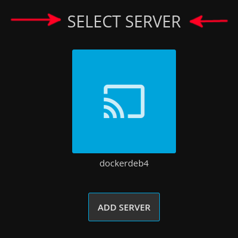

You can test/bypass the browser local storage by opening an incognito (private-mode) window :fas fa-user-secret: and login there instead. 

#### FIX: Easiest Method

Click the square image above the Add Server button, and click Delete and then refresh the website to resolve the issue.

#### FIX: Medium Method

You will need to clear your browsers Local Storage ([by clearing your browser cookies](https://support.google.com/accounts/answer/32050?co=GENIE.Platform%3DDesktop&hl=en)) :fas fa-cookie-bite:.

!> Check the `Cookies and other site data` option from either the Basic or Advanced tab. Note this is different than cache. Cookies :fas fa-cookie: for all sites will be deleted.


#### FIX: Hardest Method

If you are a technical user and do not want to clear all cookies, you may clear the Local Storage for travisflix.com using the dev tools as shown in the image below:

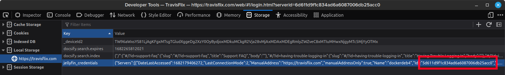

Right click the "https://travisflix.com" entry under Local Storage, and select `Delete All`.

!> If this has not resolved the problem, [check the status page](#where-is-the-status-page) and/or the [real-time server statistics](#do-you-have-server-statistics).

### If You DO NOT Receive an Error MSG:

Most likely your IP address has been banned for entering an invalid username or password. See below for more info.

### Invalid Username/Password:

:fa-solid fa-user-slash: If you have entered an invalid username/password 5 times within 15 minutes your IP address will be banned for 4 hours. When this happens you will not receive an error message, the website will simply not load and you will be staring at either the spinner :fas fa-spinner fa-spin: or a white screen.

:fa-solid fa-hourglass-end: You can either wait 4 hours and try again, try from a different public IP address, or you can [let me know](#still-have-questions) and I will reset the password/unban you. Click [here](https://travisflix.com/help/_media/support.pdf) to download this support site as a :fa-regular fa-file-pdf: pdf.

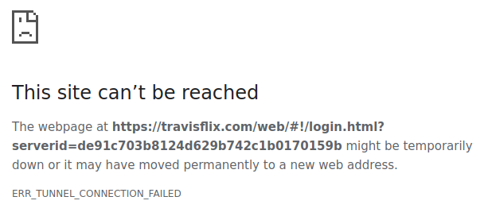

Conf:

```editorconfig
[jellyfin]

backend = pyinotify
enabled = true
port = 80,443
protocol = tcp
filter = jellyfin
maxretry = 5
bantime = 14400
findtime = 900
logpath = /usr/local/jellyfin/config/log/log_*
action = iptables-allports[name=jellyin, chain=DOCKER-USER]
ignoreself = true
ignoreip = 47.150.254.140,172.18.0.1,172.18.0.2,172.18.0.3
```


## Media Stream Playback Problems

### Wireless Users

:fa-solid fa-house-signal: I wanted to include the following tip at the very top of this section because I had this exact problem. If you are a WiFi user, the first troubleshooting step you can perform on your own is to get off the wireless and hardwire yourself in with a standard CAT 5e/6 ethernet cable :fas fa-ethernet:. If you only have CAT 5, do yourself a favor **throw that shit away**.

If you insist on using WiFi, then you are going to need to ensure that you are connected to a SSID that uses 802.11AC (or the newer 802.11AX aka WiFi6) and is using a channel width of 80, or 160 MHz. 

?> Keep in mind larger channel widths provide higher bandwidth at the expense of additional congestion of the wireless spectrum for neighboring devices.
The 802.11N standard can utilize both 2.4 + 5 Ghz frequencies. Just because you assume you are on 5 Ghz (by connecting to a SSID with "-5G" appended), that technically does not indicate you are on 802.11AC. If you need help to do simple verification, contact your nearest tech-savvy family relative instead of me.


### Hardwire Users

1. During video playback—In your browser click the settings/cog :fa fa-cog: button underneath the progress bar to the right of the video controls
2. Ensure `QUALITY` is set to `AUTO`
3. Click `PLAYBACK DATA`
4. Under `Playback Info`, determine the play type displayed next to `Play method:`
5. If it is `DirectPlay`, this means the server is streaming the direct media file to your computer without a problem, however the cause of intermittent buffering/glitching could be due to you not having enough bandwidth to support the playback of the media file. This does not necessarily mean your ISP connection does not have enough bandwidth, but could mean:
    * Your connection to your home router or switch has an issue
    * The available bandwidth is being consumed by another user
    * Your internet traffic is being shaped by your ISP with observable negative impact
    * Go to [run a speed test](#run-a-speed-test) to run a bandwidth test directly against the travisflix.com server


You can also get a sense for how much bandwidth is required by looking at the videos bitrate info which is available by clicking on the ellipsis  :fa-solid fa-ellipsis-vertical:  of the medias image poster, then clicking `Media Info`.

 ... 


### Video Not Filling The Screen

* :movie_camera: Movies are composed in a variety of shapes, called aspect ratios. Most of these aspect ratios do not match the exact aspect ratio of your widescreen TV or computer monitor. Most older movies were made primarily in the 1.37:1 aspect ratio. This means that the image is 1.37 times as wide as it is high.
* A typical widescreen HDTV set has an aspect ratio of 1.78:1. This means that it is 1.78 times as wide as it is high. This ratio was determined several years ago by looking at all the aspect ratios in use and 1.78:1 fit every aspect ratio within its borders in some way. Very few movies were ever produced in 1.78:1 (the most notable being Toy Story), so you are going to see black bars on many movies that are shown in their original aspect ratio.
* Films with an aspect ratio of less than 1.78:1 will have black bars displayed on the sides of a widescreen HDTV. A movie with an aspect ratio greater than 1.78:1 will have black bars at the top and bottom. :left_right_arrow:

### Video is Not Streaming

:game_die: First, try to eliminate the more obvious culprits such as using an old device, system, operating system, or browser.

1. Verify that you have sufficient internet download bandwidth. As a general rule of thumb you should have at least 20+ Mbps for streaming most movies and 40+ Mbps for TV Shows. Go to [speed.travisflix.com](http://speed.travisflix.com/) to test your bandwidth directly against the travisflix server.
2. Check if [multiple versions](#how-to-stream-multiple-versions-of-a-film) are available of the stream you are having trouble with.
    * If multiple versions exist then try selecting the version in the drop-down menu which was not selected by default, then hit Play.
    * Versions with `RARBG` in the suffix are recommended.
    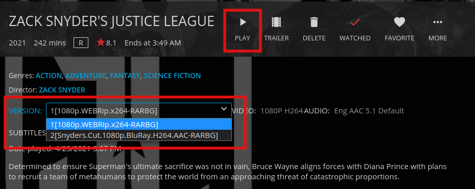
3. If you still have the problem, message me in the telegram group at [t.me/travisflix](https://t.me/travisflix) :fab fa-telegram: or see more [contact info](#still-have-questions).


### Subtitles Not Loading

:far fa-closed-captioning: This problem mostly occurs with TV show episodes, but could occur with some movies as well. After you have selected the subtitle and it fails, wait about 15 seconds and re-select the same subtitle again.
The root cause results from the server needing to retrieve the entire media file from the data-source before the subtitle stream can be extracted and pushed out to the client.


## Supported Devices or Platforms

Go to the official Jellyfin site for the list of all [supported clients](https://jellyfin.org/downloads/clients/all) (user streaming devices such as Roku or FireStick). For a curated/compact version of the supported clients page, you can use the sub-sections below, or visit the Jellyfin [documentation](https://jellyfin.org/docs/) for additional in-depth information.

### Browsers

The goal is to provide support for the two most recent versions of these browsers.

* :fa-brands fa-firefox: Firefox
* :fa-brands fa-firefox: Firefox ESR
* :fa-brands fa-chrome: Chrome
* :fa-brands fa-chrome: :fab fa-android: Chrome for Android
* :fa-brands fa-safari: Safari for MacOS and iOS
* :fa-brands fa-edge: Edge

### Android

**Jellyfin for Android**

The official Jellyfin Android app, which supports Android 5 and above.

Status: :fa-solid fa-star: Active

Links:

[](https://play.google.com/store/apps/details?id=org.jellyfin.mobile)
[](https://www.amazon.com/gp/aw/d/B081RFTTQ9)
[](https://f-droid.org/en/packages/org.jellyfin.mobile/)

* [Github.com/jellyfin/jellyfin-android](https://github.com/jellyfin/jellyfin-android)
* [jellyfin.org/clients/#android](https://jellyfin.org/clients/#android)

### Amazon FireTV Stick & AndroidTV

Jellyfin Android TV is the official Jellyfin client for Android TV, NVIDIA Shield, and Amazon Fire TV devices.

Status: :fa-solid fa-star: Active

Links:

[](https://play.google.com/store/apps/details?id=org.jellyfin.androidtv)
[](https://www.amazon.com/gp/aw/d/B07TX7Z725)

* [github.com/jellyfin/jellyfin-androidtv](https://github.com/jellyfin/jellyfin-androidtv)
* [jellyfin.org/clients/#androidtv](https://jellyfin.org/clients/#androidtv)

### Roku

Jellyfin for Roku

Status: :fa-solid fa-star: Active

Links:

[](https://channelstore.roku.com/details/592369/jellyfin)

* [github.com/jellyfin/jellyfin-roku](https://github.com/jellyfin/jellyfin-roku)

### Findroid

Findroid is a third-party Android application for Jellyfin that provides a native user interface to browse and play movies and series.

Status: :fa-solid fa-star: Active, 3rd-Party

Links:

[](https://play.google.com/store/apps/details?id=dev.jdtech.jellyfin)
[](https://apt.izzysoft.de/fdroid/index/apk/dev.jdtech.jellyfin)

* [github.com/jarnedemeulemeester/findroid](https://github.com/jarnedemeulemeester/findroid)

### Apple

**Jellyfin for iOS**

The official Jellyfin iOS client.

Status: :fa-solid fa-star: Active

Links:

[](https://apps.apple.com/us/app/jellyfin-mobile/id1480192618)

* [github.com/jellyfin/jellyfin-expo](https://github.com/jellyfin/jellyfin-expo)

**SwiftFin for iOS/tvOS**

:fa-brands fa-apple: The Jellyfin app rewritten in Swift in order to support HDR and direct play capabilities for multiple formats.

Status: :fa-solid fa-star-half-stroke: In-Development

Links:

[](https://testflight.apple.com/join/oZd0QzWv)

* [github.com/jellyfin/SwiftFin](https://github.com/jellyfin/SwiftFin)

**Infuse for iOS/Apple TV**

:fa-brands fa-apple: A third party client with HDR support and direct play capabilities for multiple formats.

Status: :fa-solid fa-star: Active, 3rd-Party

Links:

[](https://apps.apple.com/app/id1136220934?mt=8)

* [firecore.com/infuse](https://firecore.com/infuse)

**MrMC for iOS/Apple TV**

:fa-brands fa-apple: A third party app with direct play and HDR support. Available on iOS and Apple TV.

Status: :fa-solid fa-star: Active, 3rd-Party

Links:

* [mrmc.tv](https://mrmc.tv/)

### LG WebOS

The official Jellyfin WebOS app.

Status: :fa-solid fa-star-half-stroke: In-Development

Links:

* [github.com/jellyfin/jellyfin-webos](https://github.com/jellyfin/jellyfin-webos)

### Samsung TV

The official Jellyfin Samsung TV client for TVs running Tizen (2015 and above models).

Status: :fa-solid fa-star-half-stroke: In-Development

Links:

* [github.com/jellyfin/jellyfin-tizen](https://github.com/jellyfin/jellyfin-tizen)


### Cross-Platform Clients

**Kodi**

Kodi thick client for Jellyfin. This add-on syncs your Jellyfin metadata into Kodi's local database for a more native feel.

Status: :fa-solid fa-star: Active

Links:

* [github.com/jellyfin/jellyfin-kodi](https://github.com/jellyfin/jellyfin-kodi)
* [Installing](https://jellyfin.org/docs/general/clients/kodi.html)

**JellyCon**

Kodi thin client for Jellyfin. This add-on is fully dynamic and allows for fast user switching and is compatible with other Kodi sources.

Status: :fa-solid fa-star: Active

Links:

* [github.com/jellyfin/jellycon](https://github.com/jellyfin/jellycon)
* [Installing](https://jellyfin.org/docs/general/clients/kodi.html)


**Jellyfin Media Player**

Desktop client using jellyfin-web with embedded MPV player. Supports direct play of most file formats on Windows, Mac OS, and Linux. Media plays within the same window using the jellyfin-web interface unlike Jellyfin Desktop. Supports audio passthrough. Based on Plex Media Player.

Status: :fa-solid fa-star: Active

Links:

* [github.com/jellyfin/jellyfin-media-player](https://github.com/jellyfin/jellyfin-media-player)
* [Binary Releases](https://github.com/jellyfin/jellyfin-media-player/releases)
* [Flathub](https://flathub.org/apps/details/com.github.iwalton3.jellyfin-media-player)

**Jellyfin MPV Shim**

Provides background cast client using MPV. The client has support for direct play of advanced codecs such as 10 bit HEVC with subtitles, many customizable options, and whole-season subtitle preference support.

Status: :fa-solid fa-star: Active

Links:

* [github.com/jellyfin/jellyfin-mpv-shim](https://github.com/jellyfin/jellyfin-mpv-shim)
* [Windows Release](https://github.com/jellyfin/jellyfin-mpv-shim/releases)
* [Flathub](https://flathub.org/apps/details/com.github.iwalton3.jellyfin-mpv-shim)

**jftui**

:fa-brands fa-linux: A terminal client for Jellyfin built as a REPL interface, that uses mpv for multimedia playback.

Status: :fa-solid fa-star: Active, 3rd-Party

Links:

* [github.com/Aanok/jftui](https://github.com/Aanok/jftui)


## How to Stream Multiple Versions of a Film

A subset of movies will have multiple versions available for playback. The reasons usually include native language and dubbed versions or differing qualities (ie: 720p/1080p/4K) or video codecs (H.264/H.265). I tried to standardize every films default version in its original language with dubbed/alternate versions available as the secondary option. I'm not sure how many films have multiple versions but it's probably in the 100-250 range.

**Examples:**

Space Sweepers (2021) is configured with the films native language (Korean) as the default version, with an English dubbed version selectable for playback as the second option in the version drop-down menu.

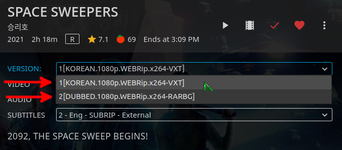

Avatar (2009) has 4 different versions available (1080p Reg/1080p High/720p BrRip/4K 2160p upscaled) as indicated by the number 4 yellow circle at the top left hand corner of the movie poster image.


Apocolypse Now (1979) has 3 distinct editions available:


## How to use Quick Connect

Starting with Jellyfin server version 10.7.0 and supported clients, you can use Quick Connect to sign in to your account without the need of a password. You need to previously be logged into a supported client, like the default Jellyfin Web Client.

**Using Quick Connect**

To sign in to a supported client, you have to enter the Quick Connect code in your user settings.
<br>
Settings > Quick Connect

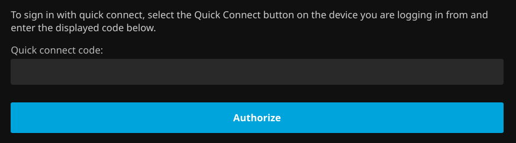

If the code is validated successfully, your new device will be signed in without entering your Jellyfin username or password on the new device.
<br>
The client will generate a 6 digit code, which you have to enter in the already signed in client in your user settings.

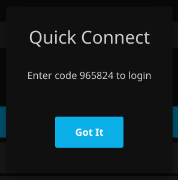


## Running a Speed Test

:fa-solid fa-gauge-high: Go to [speed.travisflix.com](http://speed.travisflix.com/) to run a bandwidth test directly against the web server. This will give you the most accurate relevant network bandwidth results vs running it against an arbitrary location. If the download test results report less than ~30 Mbps your internet bandwidth is probably inadequate for streaming on my site.

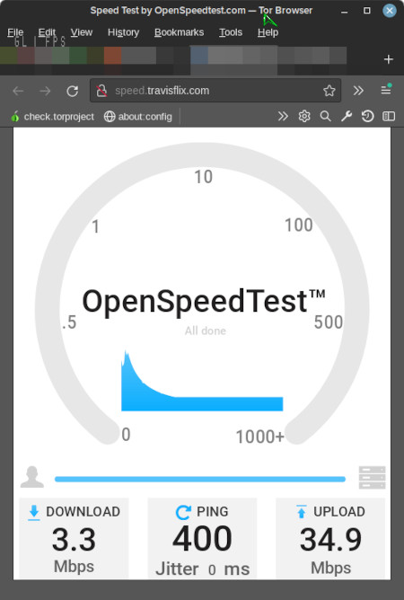


## Media Information & Standards

> Video: **[H.264 (AVC)](https://www.streamingmedia.com/Articles/Editorial/What-Is-.../What-Is-H.264-74735.aspx)** / Audio: **[AAC](https://en.wikipedia.org/wiki/Advanced_Audio_Coding) 5.1CH**

Virtually all media on the site will be using the video/audio codec specs listed below.
The actual media file itself may be in either the standard "mp4" ([Mpeg-4](https://en.wikipedia.org/wiki/MPEG-4_Part_14)), or "mkv" ([Matroska](https://en.wikipedia.org/wiki/Matroska)), which are referred to as containers. Containers themselves have nothing to do with the codec used for the video and audio streams. Containers can be thought of as universally recognized digital media delivery packages. However despite this understanding, shitty media handling implementation by the major mobile OS developers (you know the ones I'm talkin' about) may force the server to strip the container off of the internal media streams before repackaging and delivering it to mobile devices in a format more easily consumed, such as "ts" ([Transport Stream](https://en.wikipedia.org/wiki/MPEG_transport_stream)).


| **Video**||
|---|---|
| Format: | AVC |
| Format/Info: | Advanced Video Codec |
| Format profile: | High@L4.1 |
| Format settings: | CABAC / 4 Ref Frames |
| Codec ID/Info: | Advanced Video Coding |
| Bit rate: | 2 500 kb/s |
| Frame rate mode: | Constant |
| Frame rate: | 23.976 (23976/1000) FPS |
| Color space: | YUV |
| Bit depth: | 8 bits |
| Scan type: | Progressive |
| Writing library: | x264 core 152 r2851M ba24899 |
|  ||
|**Audio**||
| Format: | AAC LC |
| Format/Info: | Advanced Audio Codec Low Complexity |
| Codec ID: | mp4a-40-2 |
| Bit rate mode: | Constant |
| Bit rate: | 224 kb/s |
| Channel(s): | 6 channels |
| Channel layout: | C L R Ls Rs LFE |
| Sampling rate: | 48.0 kHz |
| Frame rate: | 46.875 FPS (1024 SPF) |
| Compression mode: | Lossy |

TravisFlix is a self-curated reflection of my personal taste in film, in general. There is a heavy concentration of media in the documentary genre in both the movies and TV series categories (16% of the movies and 28% of the tv shows are documentaries).

You can view them by using the **GENRES** link at the top of each media type, then find the genre **DOCUMENTARY** and click on it. Another method is using the filter () feature which is directly above the media poster images on every library.

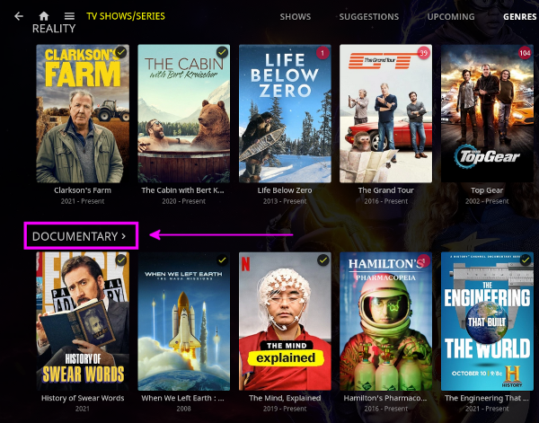


## Movies Still in the Theater

Occasionally I will add movies that are still playing in movie theaters if the video/audio quality is sufficient for the time being.
If the movie title includes the words HDTS, or HDCAM then you can be sure that the particular movie is not the final release quality.

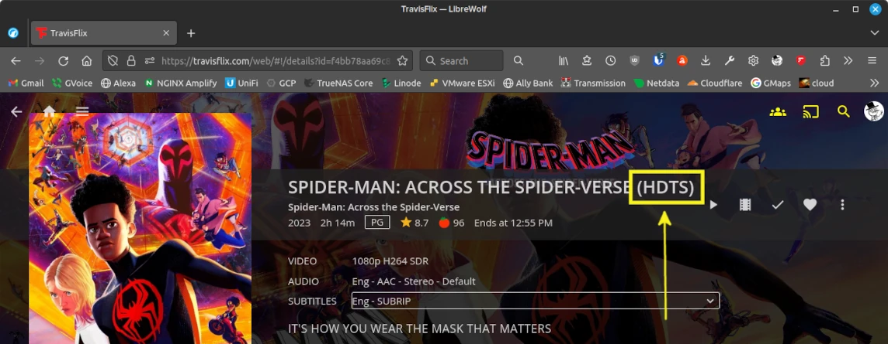


## ~~Connecting over Tor Network~~

?> 🧅 ~~Onion address: http://zzjymusfscxydtjnhtcpabgu5eldgg3evs23esvirlznxs6luvqpecqd.onion~~

~~Visiting [travisflix.com](https://travisflix.com) via the [Tor Browser](https://www.torproject.org/), you will automatically be redirected to the onion address. This is the recommended method to access the Tor site version.~~

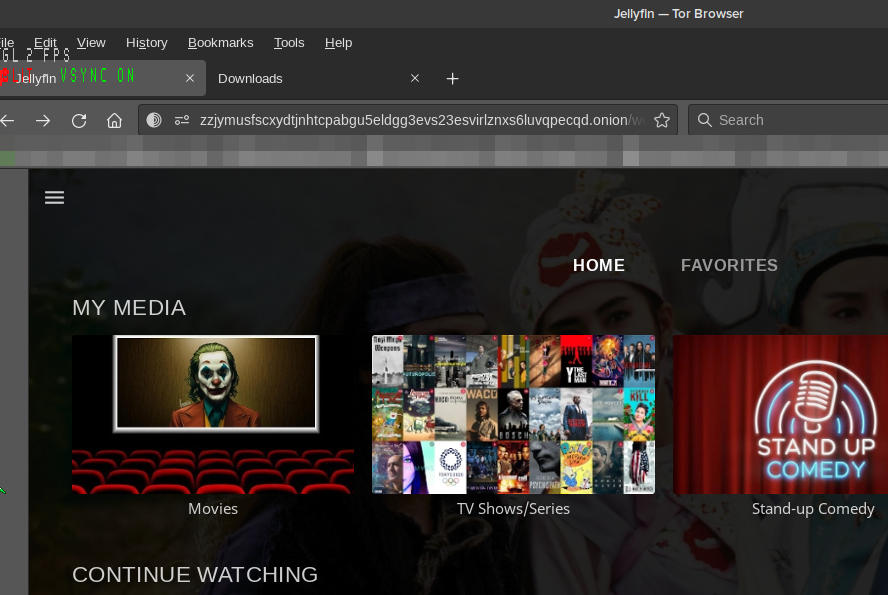

~~As a workaround method for downloading multiple videos simultaneously, you may use Tor as an option for getting around the public IP download limit. If you use this option you should expect slower downloads (~250KiB/s)~~


## Downloading Movies & Shows

:fa-solid fa-download: You can download anything that you see. Click on the ellipsis  :fa-solid fa-ellipsis-vertical:  of the media you want to download and then click DOWNLOAD :fa-regular fa-floppy-disk:.

!> :fa-regular fa-face-frown fa-lg: Downloading is rate limited to 5,120 KiB/s (5 MiB/s = ~40 Mbps) and capped at 3 downloads at a time per ip address.

?> ~~As a workaround method for downloading multiple videos simultaneously, you may use the 🧅 Tor [onion address](#connecting-over-tor-network) as an option for getting around the public IP download limit. If you use this option you should expect slower downloads (~250KiB/s)~~

web config:

```nginx
    location ~ ^/Items/(.*)/Download$ {
        limit_rate 5120k; # Speed in KB/s (Kilobytes)
        limit_conn perip 3; # Simultaneous connections per ip address
        limit_conn_status 429;
        proxy_buffering on; # Required for limit_conn
        proxy_set_header Host $host;
        proxy_set_header X-Real-IP $remote_addr;
        proxy_set_header X-Forwarded-For $proxy_add_x_forwarded_for;
        proxy_set_header X-Forwarded-Proto $scheme;
        proxy_set_header X-Forwarded-Protocol $scheme;
        proxy_set_header X-Forwarded-Host $http_host;
        add_header X-Nginx-IPCountry $HTTP_CF_IPCOUNTRY;
        add_header X-Nginx-ClientIP $remote_addr;
        add_header X-Nginx-ServerIP $server_addr;
        add_header X-Nginx-Forwarded-For $proxy_add_x_forwarded_for;
        add_header X-Nginx-Forwarded-Host $http_host;
        proxy_pass http://jellyfin_server;
    }
```


## Remote Control of Shared Devices

:fa-brands fa-slideshare: Sorry, feature had been broken ever since I applied network-level firewall rules. You should now be able to control your other devices as long as you are logged in with the same account. Problem was inbound UDP/1900 for DLNA not open, whoopsie daisy. [travisflix.com](https://travisflix.com/) ~~traverses two independent reverse proxies as well~~ so things can get a little confusing and hard to keep track of for me.


1. Log in with your browser first
2. Log in with the device you are wanting to remotely control (must not be identical to the controlling device, needs separate internal ID's)
3. Immediately after step 2, click the icon highlighted in the image below
4. Then click on the device you are wanting to control
5. Once that icon displays the controlled device next to it, search/browse the desired media and click play like normal
6. It should now be playing what you clicked on your remotely controlled device

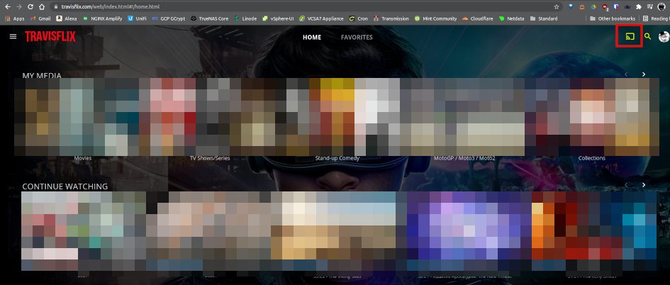

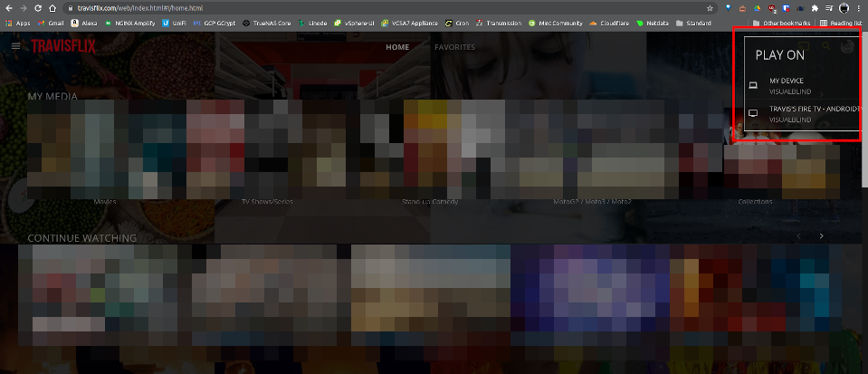


## Uploading Files

1. :fas fa-cloud-upload-alt: Go to [files.travisflix.com](https://files.travisflix.com/)
2. Credentials: **username** — upload | **password** — upload
3. Click the Upload button and select the media for upload
?> You can select multiple files/folders per upload session
4. [Join](https://t.me/+bpRYE4pTaRM1MmYx) the TravisFlix [Telegram group](https://t.me/travisflix) and send me a message


## Plain-text media list/index

These plain-text files contain an index of all media for which it corresponds. The files are regenerated every hour 24/7/365 for the most up-to-date media info.

:fas fa-list: [/movies.txt](https://travisflix.com/movies.txt)<br>
:fas fa-list: [/shows.txt](https://travisflix.com/shows.txt)<br>
:fas fa-list: [/standup.txt](https://travisflix.com/standup.txt)<br>
:fas fa-list: [/motogp.txt](https://travisflix.com/motogp.txt)<br>
:fas fa-list: [/formula1.txt](https://travisflix.com/formula1.txt)<br>
:fas fa-list: [/tennis.txt](https://travisflix.com/tennis.txt)<br>
:fas fa-list: [/podcasts.txt](https://travisflix.com/podcasts.txt)<br>

Bash script that generates the files:

```bash
#!/usr/bin/env bash

nginx_www='/usr/local/linuxserver-nginx/config/www'
jf_media='/usr/local/jellyfin/media'

if [[ -d /usr/local/jellyfin/media && -f /usr/local/jellyfin/media/scriptcheck ]]; then
    # Rclone mount exists, no need to remount

    # Exit script if variable is empty
    [ -z "$nginx_www" ] && { echo "Error: variable nginx_www is not set or empty"; exit 1; }

    # Refresh public text files with media index
    cd /usr/local/jellyfin/media
    find /usr/local/jellyfin/media/video-movies -mindepth 1 -maxdepth 1 -type d -printf '%f\n' | sort > $nginx_www/movies.txt
    find /usr/local/jellyfin/media/video-shows -mindepth 1 -maxdepth 1 -type d -printf '%f\n' | sort > $nginx_www/shows.txt
    tree --noreport -d --charset=en_US.utf8 /usr/local/jellyfin/media/video-shows >> $nginx_www/shows.txt
    find /usr/local/jellyfin/media/video-standup -mindepth 1 -maxdepth 1 -type d -printf '%f\n' | sort > $nginx_www/standup.txt
    find /usr/local/jellyfin/media/video-tennis -mindepth 1 -maxdepth 1 -type d -printf '%f\n' | sort --reverse > $nginx_www/tennis.txt
    find /usr/local/jellyfin/media/video-starcraft -mindepth 1 -maxdepth 1 -type f -printf '%f\n' | sort --reverse > $nginx_www/starcraft.txt
    find /usr/local/jellyfin/media/video-tech -mindepth 1 -maxdepth 1 -type d -printf '%f\n' | sort > $nginx_www/tech.txt
    find /usr/local/jellyfin/media/podcasts -mindepth 1 -maxdepth 2 -type d -printf '%f\n' | sort > $nginx_www/podcasts.txt
    tree --noreport --charset=en_US.utf8 /usr/local/jellyfin/media/podcasts >> $nginx_www/podcasts.txt
    # Sort reversed
    find /usr/local/jellyfin/media/video-motogp -mindepth 1 -maxdepth 1 -type d -printf '%f\n' | sort --reverse > $nginx_www/motogp.txt
    find /usr/local/jellyfin/media/video-formula1 -mindepth 1 -maxdepth 1 -type d -printf '%f\n' | sort --reverse > $nginx_www/formula1.txt
else
    exit 1
fi
```


## Where is the status page

:fas fa-server: [status.travisflix.com](https://status.travisflix.com/)

The cumulative 30-day HTTPS uptime for the travisflix.com web service has on average been between **99.95%** - **99.99%**


?> This percentage is referred to as "SLA" (service level agreement). For instance, the [Google Workspace SLA](https://workspace.google.com/intl/en/terms/sla.html) is 99.9% for Search, Gmail, Docs, Drive, Chat, Voice, etc.
You can view the status for Google [here](https://www.google.com/appsstatus).

<!-- 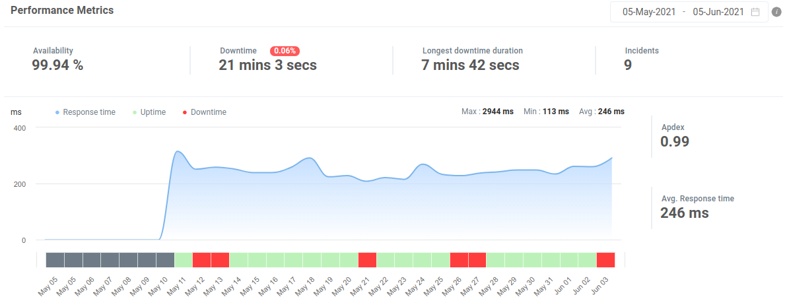 -->

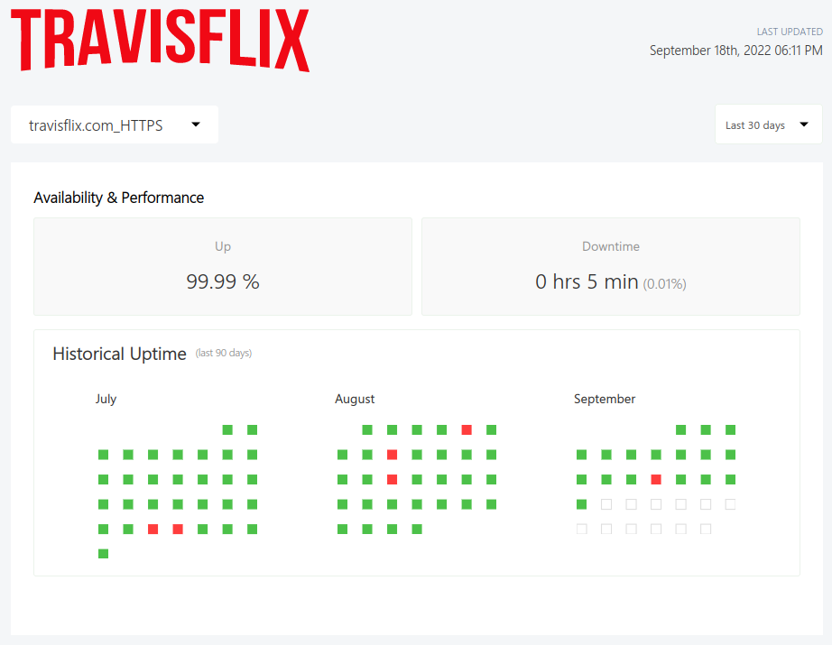

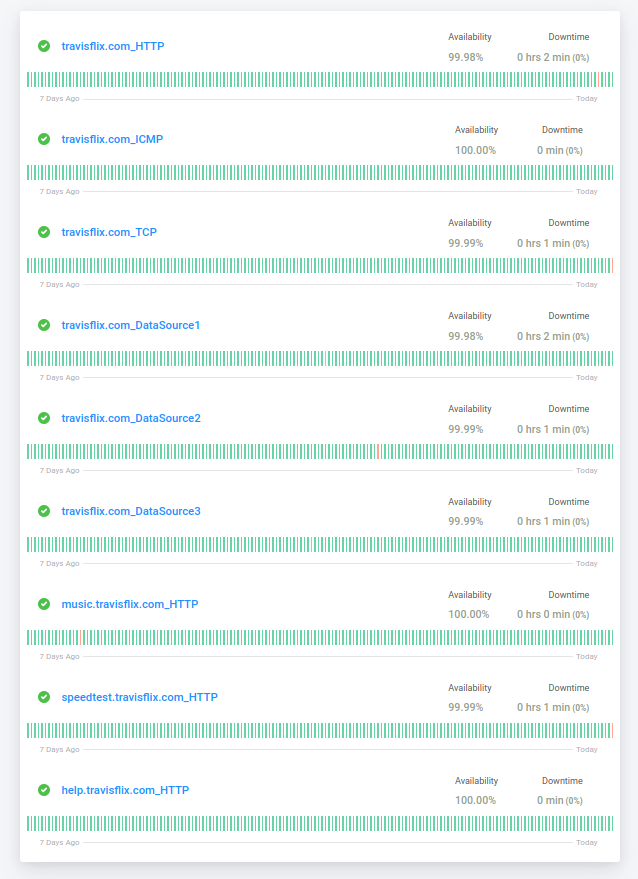


## Do you have server statistics

> :fas fa-server: [statistics.travisflix.com](https://statistics.travisflix.com/)


The following iframe represents the same data as on [statistics.travisflix.com](https://statistics.travisflix.com/).

<iframe src="//statistics.travisflix.com/netdata-dark.html" width="100%" height="870px" style="border:0px;overflow-y:visible;" scrolling="yes"></iframe>


## How to Support/Donate

Please donate if you are able to spare a few dollars. All donations will help ensure this site stays up and running, and the content library continues to increase in size and variety.


### Cash App

Cash App ID: [$visualblind](https://cash.app/$visualblind)

<p align="center">

</p>

### Venmo

Venmo ID: [visualblind](https://venmo.com/visualblind)

This is my profile picture on Venmo:

  


### Open Collective Donation

:fa-solid fa-credit-card: Credit cards accepted, use the button below to donate any amount you want.

[](https://opencollective.com/travisflix/donate)

### Stripe

:fa-solid fa-credit-card: Credit cards accepted, use the link below to donate any amount you want.

Payment link: [https://donate.stripe.com/9AQfZJ9plfKi7io000](https://donate.stripe.com/9AQfZJ9plfKi7io000)


### Bitcoin 

Bitcoin is the preferred cryptocurrency but if you would rather use a different crypto just [let me know](#still-have-questions) and we can arrange it.

> :fa-brands fa-bitcoin: **Option #1**
> [bc1q690p3utevcus3mscnq5anegz7a3m7cjv4vvd6g](bitcoin:bc1q690p3utevcus3mscnq5anegz7a3m7cjv4vvd6g)
> 
> ---
> :fa-brands fa-bitcoin: **Option #2**
> [32Z8bRQPcip4avcGWujSqLGAmDt52m1Wy4](bitcoin:32Z8bRQPcip4avcGWujSqLGAmDt52m1Wy4)<br>
> [](https://greenaddress.it/pay/GA2GtnSV73LMTzpauEKZsJnRD1yxWf/)
>
> QR Code:<br>
> 

#### Real-time Bitcoin Price (USD):
<iframe id="iframebtc" src="//btc.travisflix.com" width="100%" height="35px" style="border:0px;overflow-y:hidden;" scrolling="no"></iframe>


## Still have questions?

* :incoming_envelope: Email address: <travis@travisflix.com>
* :fab fa-telegram: [Join](https://t.me/+bpRYE4pTaRM1MmYx) the TravisFlix [Telegram Group](https://t.me/travisflix), or use the QR code below
* :fa-regular fa-address-card: Contact info is available online at [blog.travisflix.com/about](https://blog.travisflix.com/about/) or use the [contact](https://blog.travisflix.com/about/contact/) form
* :fa-solid fa-comments: ~~Join the Matrix Chatroom at [matrix.to/#/#travisflix.com:matrix.org](https://matrix.to/#/#travisflix.com:matrix.org)~~

<p align="center">

</p>
